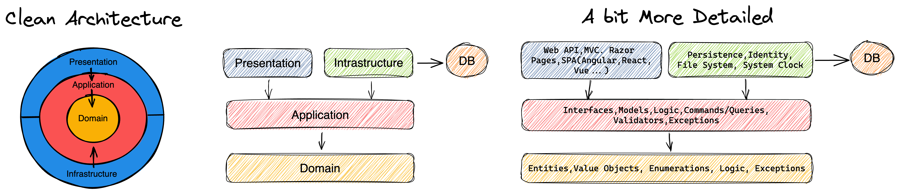
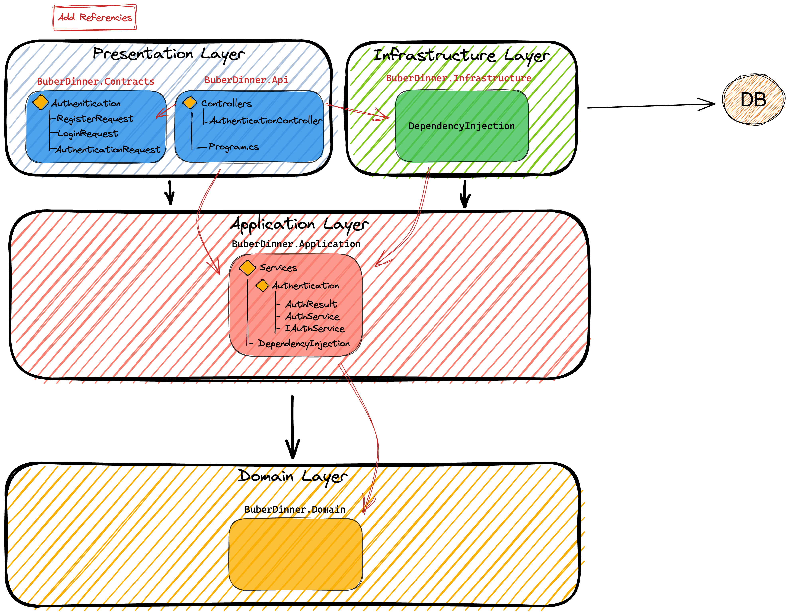
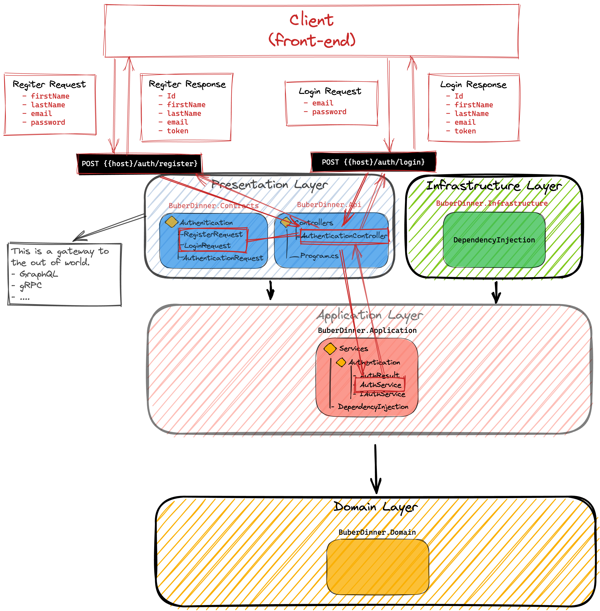

# CLEAN_ARCHITECTURE_DDD

## Contents

### Source

    https://www.youtube.com/watch?v=ZwQf_JQUUCQ&t=576s

### Clean Architecture



### Project Architecture


### Create project

```dotnetcli
dotnet new sln -o CLEAN_ARCHITECTURE_DDD
cd CLEAN_ARCHITECTURE_DDD
dotnet new webapi -o BuberDinner.Api
dotnet new classlib -o BuberDinner.Contracts
dotnet new classlib -o BuberDinner.Infrastructure
dotnet new classlib -o BuberDinner.Application
dotnet new classlib -o BuberDinner.Domain
```

### Build project

1.  origin info
    ```dotnetcli
     more ./CLEAN_ARCHITECTURE_DDD.sln
    ```
2.  Add project to `.sln`
    ```dotnetcli
    dotnet sln add (ls -r **/*.csproj)
    ```
3.  Build the project
    ```dotnetcli
    dotnet build
    ```

### Create dependencies between Projects

#### Api Add Reference to Contracts, Application

```dotnetcli
dotnet add ./BuberDinner.Api/ reference ./BuberDinner.Contracts/ ./BuberDinner.Application/
```

#### Infrastructure Add Reference to Application

```dotnetcli
dotnet add ./BuberDinner.Infrastructure/ reference ./BuberDinner.Application/
```

#### Application Add Reference to Domain

```dotnetcli
dotnet add ./BuberDinner.Application/ reference ./BuberDinner.Domain/
```

#### Api Add Reference to Infrastructure

```dotnetcli
dotnet add ./BuberDinner.Api/ reference ./BuberDinner.Infrastructure/
```

#### Conculsion

for now we have five folders in this solution, and also you can see these five projects in `CLEAN_ARCHITECTURE_DDD.sln`

```
.
├── BuberDinner.Api
├── BuberDinner.Application
├── BuberDinner.Contracts
├── BuberDinner.Domain
├── BuberDinner.Infrastructure
├── CLEAN_ARCHITECTURE_DDD.sln
├── README.md
├── Request
└── images
```

to open the _BuberDinner.Api_, you can see the .Net.Sdk.Web in the `.csproj`

<hr>

### Build the solution

```dotnetcli
 % dotnet build
```

### Install VSCode Extension And Test

- REST Client

#### Run Web Api

```dotnetcli
dotnet run --project ./BuberDinner.Api/
```

#### Create a new folder Request

Then create a folder `Weather` in Request folder,and create a GetForcasts.http file

```bash
Request
└── Weather
    └── GetForcasts.http
```

In `GetForcast.http` file you can write the `Get`,`Post`etc... to url and click th send Request button.Then you will get the response

```
GET http://localhost:5124/WeatherForecast
```

#### Conclusion

It's a simple tool to test request to your api end point.

<hr>

### Change BuberDinner.Api's Program.cs

for now we don't need these things

1. builder.Services.AddEndpointsApiExplorer();
2. builder.Services.AddSwaggerGen();
3. app.UseAuthorization();
4. app.UseSwagger();
5. app.UseSwaggerUI();
   so the final code will be

```cs
var builder = WebApplication.CreateBuilder(args);
{
    builder.Services.AddControllers();
}
var app = builder.Build();
{
    app.UseHttpsRedirection();
    app.MapControllers();
    app.Run();
}

```

### Delete Swashbuckle.AspNetCore in BuberDinner.Api.csproj

```
<Project Sdk="Microsoft.NET.Sdk.Web">

  <PropertyGroup>
    <TargetFramework>net6.0</TargetFramework>
    <Nullable>enable</Nullable>
    <ImplicitUsings>enable</ImplicitUsings>
  </PropertyGroup>

  <ItemGroup>
    <ProjectReference Include="..\BuberDinner.Contracts\BuberDinner.Contracts.csproj" />
    <ProjectReference Include="..\BuberDinner.Application\BuberDinner.Application.csproj" />
    <ProjectReference Include="..\BuberDinner.Infrastructure\BuberDinner.Infrastructure.csproj" />
  </ItemGroup>

</Project>
```

### Move every ItemGroup -> ProjectReference below down <PropertyGroup> in each project

### Delete Class1.cs in each project

### run dotnet build to check everything is fine

```
dotnet build
```

the current folder structure will be down below

```
.
├── BuberDinner.Api
│   ├── BuberDinner.Api.csproj
│   ├── Controllers
│   ├── Program.cs
│   ├── Properties
│   ├── WeatherForecast.cs
│   ├── appsettings.Development.json
│   ├── appsettings.json
│   ├── bin
│   └── obj
├── BuberDinner.Application
│   ├── BuberDinner.Application.csproj
│   ├── bin
│   └── obj
├── BuberDinner.Contracts
│   ├── BuberDinner.Contracts.csproj
│   ├── bin
│   └── obj
├── BuberDinner.Domain
│   ├── BuberDinner.Domain.csproj
│   ├── bin
│   └── obj
├── BuberDinner.Infrastructure
│   ├── BuberDinner.Infrastructure.csproj
│   ├── bin
│   └── obj
├── CLEAN_ARCHITECTURE_DDD.sln
├── README.md
├── Request
```

### Create a Register and Login


