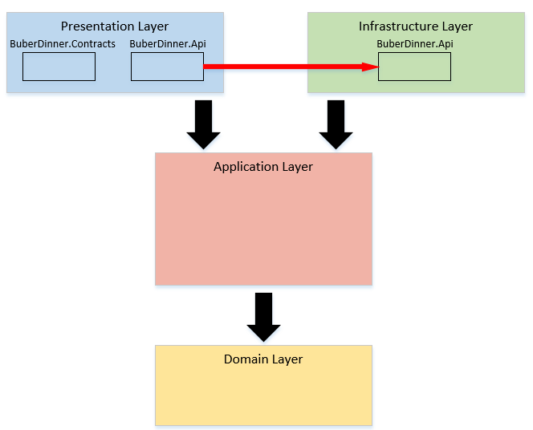

# CLEAN_ARCHITECTURE_DDD

## Contents

### Source

    https://www.youtube.com/watch?v=ZwQf_JQUUCQ&t=576s

### Project Architecture



### Create project

```dotnetcli
dotnet new sln -o CLEAN_ARCHITECTURE_DDD
cd CLEAN_ARCHITECTURE_DDD
dotnet new webapi -o BuberDinner.Api
dotnet new classlib -o BuberDinner.Contracts
dotnet new classlib -o BuberDinner.Infrastructure
dotnet new classlib -o BuberDinner.Application
dotnet new classlib -o BuberDinner.Domain
```

### Build project

1.  origin info
    ```dotnetcli
     more .\CLEAN_ARCHITECTURE_DDD.sln
    ```
2.  Add project to `.sln`
    ```dotnetcli
    dotnet sln add (ls -r **\*.csproj)
    ```
3.  Build the project
    ```dotnetcli
    dotnet build
    ```

### Create dependencies between Projects

#### Api Add Reference to Contracts, Application

```dotnetcli
dotnet add ./BuberDinner.Api/ reference ./BuberDinner.Contracts/ ./BuberDinner.Application/
```

#### Infrastructure Add Reference to Application

```dotnetcli
dotnet add ./BuberDinner.Infrastructure/ reference ./BuberDinner.Application/
```

#### Application Add Reference to Domain

```dotnetcli
dotnet add ./BuberDinner.Application/ reference ./BuberDinner.Domain/
```

#### Api Add Reference to Infrastructure

```dotnetcli
dotnet add ./BuberDinner.Api/ reference ./BuberDinner.Infrastructure/
```

#### Conculsion

for now we have five folders in this solution, and also you can see these five projects in `CLEAN_ARCHITECTURE_DDD.sln`

```
.
├── BuberDinner.Api
├── BuberDinner.Application
├── BuberDinner.Contracts
├── BuberDinner.Domain
├── BuberDinner.Infrastructure
├── CLEAN_ARCHITECTURE_DDD.sln
├── README.md
├── Request
└── images
```

to open the _BuberDinner.Api_, you can see the .Net.Sdk.Web in the `.csproj`

<br>

### Build the solution

```dotnetcli
 % dotnet build
```

### Install VSCode Extension

- REST Client

### Run Web Api

```dotnetcli
dotnet run --project .\BuberDinner.Api\
```
