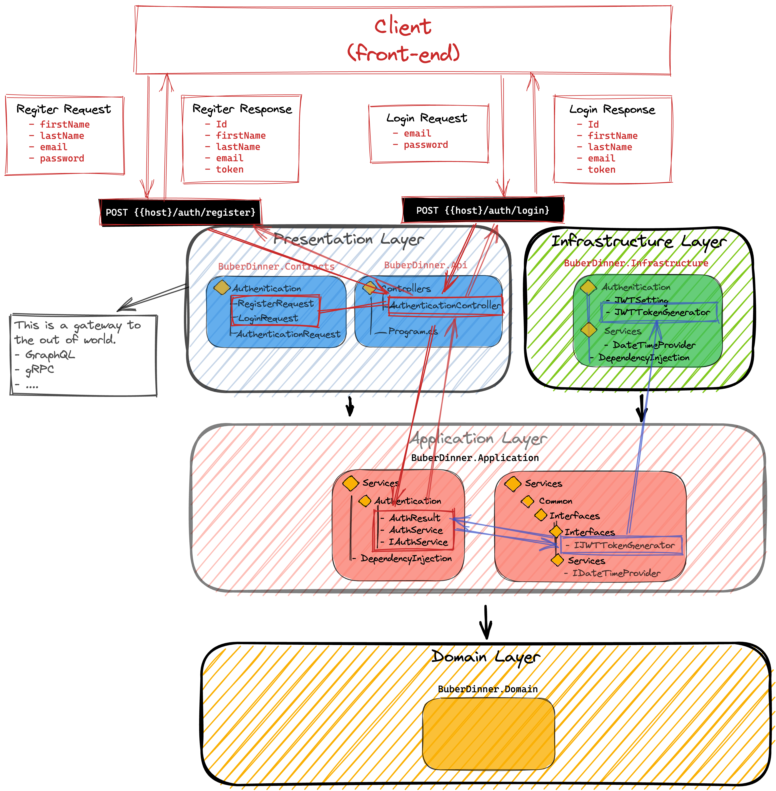

# CLEAN_ARCHITECTURE_DDD

## Contents
- [CLEAN_ARCHITECTURE_DDD](#clean_architecture_ddd)
  - [Contents](#contents)
  - [Source](#source)
  - [Part1 Summary](#part1-summary)
  - [Clean Architecture](#clean-architecture)
  - [Project Architecture](#project-architecture)
  - [Project Setup](#project-setup)
    - [Create project](#create-project)
    - [Build project](#build-project)
    - [Create dependencies between Projects](#create-dependencies-between-projects)
      - [Api Add Reference to Contracts, Application](#api-add-reference-to-contracts-application)
      - [Infrastructure Add Reference to Application](#infrastructure-add-reference-to-application)
      - [Application Add Reference to Domain](#application-add-reference-to-domain)
      - [Api Add Reference to Infrastructure](#api-add-reference-to-infrastructure)
    - [Build the solution](#build-the-solution)
      - [Conculsion](#conculsion)
    - [Install VSCode Extension And Test](#install-vscode-extension-and-test)
      - [Run Web Api](#run-web-api)
      - [Create a new folder Request](#create-a-new-folder-request)
      - [Conclusion](#conclusion)
      - [Change BuberDinner.Api's Program.cs](#change-buberdinnerapis-programcs)
      - [Delete Swashbuckle.AspNetCore in BuberDinner.Api.csproj](#delete-swashbuckleaspnetcore-in-buberdinnerapicsproj)
      - [Move every ItemGroup -> ProjectReference below down <PropertyGroup> in each project](#move-every-itemgroup---projectreference-below-down-propertygroup-in-each-project)
      - [Delete Class1.cs in each project](#delete-class1cs-in-each-project)
      - [run dotnet build to check everything is fine](#run-dotnet-build-to-check-everything-is-fine)
  - [Auth endpoints](#auth-endpoints)
      - [Create a folder which name Docs](#create-a-folder-which-name-docs)
    - [Model Register, Login requests & responses](#model-register-login-requests--responses)
      - [Create a folder which named Authentication in BuberDinner.Contracts](#create-a-folder-which-named-authentication-in-buberdinnercontracts)
      - [Create basic code in each .cs files](#create-basic-code-in-each-cs-files)
    - [Create a Register and Login](#create-a-register-and-login)
      - [Create Auth Controller in BuberDinner.Api](#create-auth-controller-in-buberdinnerapi)
      - [Run the project](#run-the-project)
      - [Using REST Client to test endpoint](#using-rest-client-to-test-endpoint)
    - [Create auth service which returns a mock response](#create-auth-service-which-returns-a-mock-response)
      - [import Application to Api project](#import-application-to-api-project)
      - [add Authentication Service to Services in Program.cs](#add-authentication-service-to-services-in-programcs)
      - [Test endpoints](#test-endpoints)
    - [Setup dependency injection for the application & Infrastructure layers](#setup-dependency-injection-for-the-application--infrastructure-layers)
      - [Create DependencyInjection](#create-dependencyinjection)
  - [Part2 Summary](#part2-summary)
    - [Project Architecture](#project-architecture-1)

<hr>

## Source

- YT : https://www.youtube.com/watch?v=ZwQf_JQUUCQ&t=576s
- extensions:
  - REST Client
  - NuGet Reverse Package Search 

## Part1 Summary

- Project Setup
  - Create solution & projects
  - Define project dependecies
- Auth endpoints
  - Create auth endpoints
  - Model Register, Login requests & responses
  - Create auth service which returns a mock response
- Use the 'REST Client' vscode plugin to query the API
- Setup dependency injection for the application & Infrastructure layers
<hr>

## Clean Architecture


## Project Architecture


## Project Setup

### Create project

```dotnetcli
dotnet new sln -o CLEAN_ARCHITECTURE_DDD
cd CLEAN_ARCHITECTURE_DDD
dotnet new webapi -o BuberDinner.Api
dotnet new classlib -o BuberDinner.Contracts
dotnet new classlib -o BuberDinner.Infrastructure
dotnet new classlib -o BuberDinner.Application
dotnet new classlib -o BuberDinner.Domain
```

### Build project

1.  origin info
    ```dotnetcli
     more ./CLEAN_ARCHITECTURE_DDD.sln
    ```
2.  Add project to `.sln`
    ```dotnetcli
    dotnet sln add (ls -r **/*.csproj)
    ```
3.  Build the project
    ```dotnetcli
    dotnet build
    ```

### Create dependencies between Projects

#### Api Add Reference to Contracts, Application

```dotnetcli
dotnet add ./BuberDinner.Api/ reference ./BuberDinner.Contracts/ ./BuberDinner.Application/
```

#### Infrastructure Add Reference to Application

```dotnetcli
dotnet add ./BuberDinner.Infrastructure/ reference ./BuberDinner.Application/
```

#### Application Add Reference to Domain

```dotnetcli
dotnet add ./BuberDinner.Application/ reference ./BuberDinner.Domain/
```

#### Api Add Reference to Infrastructure

```dotnetcli
dotnet add ./BuberDinner.Api/ reference ./BuberDinner.Infrastructure/
```
### Build the solution

```dotnetcli
 % dotnet build
```
#### Conculsion

for now we have five folders in this solution, and also you can see these five projects in `CLEAN_ARCHITECTURE_DDD.sln`

```
.
├── BuberDinner.Api
├── BuberDinner.Application
├── BuberDinner.Contracts
├── BuberDinner.Domain
├── BuberDinner.Infrastructure
├── CLEAN_ARCHITECTURE_DDD.sln
├── README.md
├── Request
└── images
```
<hr>

### Install VSCode Extension And Test

- REST Client

#### Run Web Api

```dotnetcli
dotnet run --project ./BuberDinner.Api/
```

#### Create a new folder Request

Then create a folder `Weather` in Request folder,and create a GetForcasts.http file

```bash
Request
└── Weather
    └── GetForcasts.http
```

In `GetForcast.http` file you can write the `Get`,`Post`etc... to url and click th send Request button.Then you will get the response

```
GET http://localhost:5124/WeatherForecast
```

#### Conclusion

It's a simple tool to test request to your api end point.

<hr>

#### Change BuberDinner.Api's Program.cs

for now we don't need these things

1. builder.Services.AddEndpointsApiExplorer();
2. builder.Services.AddSwaggerGen();
3. app.UseAuthorization();
4. app.UseSwagger();
5. app.UseSwaggerUI();  
so the final code will be

```cs
var builder = WebApplication.CreateBuilder(args);
{
    builder.Services.AddControllers();
}
var app = builder.Build();
{
    app.UseHttpsRedirection();
    app.MapControllers();
    app.Run();
}

```

#### Delete Swashbuckle.AspNetCore in BuberDinner.Api.csproj

```
<Project Sdk="Microsoft.NET.Sdk.Web">

  <PropertyGroup>
    <TargetFramework>net6.0</TargetFramework>
    <Nullable>enable</Nullable>
    <ImplicitUsings>enable</ImplicitUsings>
  </PropertyGroup>

  <ItemGroup>
    <ProjectReference Include="..\BuberDinner.Contracts\BuberDinner.Contracts.csproj" />
    <ProjectReference Include="..\BuberDinner.Application\BuberDinner.Application.csproj" />
    <ProjectReference Include="..\BuberDinner.Infrastructure\BuberDinner.Infrastructure.csproj" />
  </ItemGroup>

</Project>
```

#### Move every ItemGroup -> ProjectReference below down <PropertyGroup> in each project

#### Delete Class1.cs in each project

#### run dotnet build to check everything is fine

```
dotnet build
```

the current folder structure will be down below

```
.
├── BuberDinner.Api
│   ├── BuberDinner.Api.csproj
│   ├── Controllers
│   ├── Program.cs
│   ├── Properties
│   ├── WeatherForecast.cs
│   ├── appsettings.Development.json
│   ├── appsettings.json
│   ├── bin
│   └── obj
├── BuberDinner.Application
│   ├── BuberDinner.Application.csproj
│   ├── bin
│   └── obj
├── BuberDinner.Contracts
│   ├── BuberDinner.Contracts.csproj
│   ├── bin
│   └── obj
├── BuberDinner.Domain
│   ├── BuberDinner.Domain.csproj
│   ├── bin
│   └── obj
├── BuberDinner.Infrastructure
│   ├── BuberDinner.Infrastructure.csproj
│   ├── bin
│   └── obj
├── CLEAN_ARCHITECTURE_DDD.sln
├── README.md
├── Request
```
## Auth endpoints


#### Create a folder which name Docs

```
Docs
└── Api.md
```
### Model Register, Login requests & responses
#### Create a folder which named Authentication in BuberDinner.Contracts
Then Create `RegisterRequest.cs`, `LoginRequest.cs` and `AuthenticationResponse.cs`

```
BuberDinner.Contracts
├── Authentication
│   ├── AuthenticationResponse.cs
│   ├── LoginRequest.cs
│   └── RegisterRequest.cs
└── BuberDinner.Contracts.csproj
```
#### Create basic code in each .cs files
you can see details in these files

### Create a Register and Login

#### Create Auth Controller in BuberDinner.Api
- project structure:
```
BuberDinner.Api
├── BuberDinner.Api.csproj
├── Controllers
│   ├── AuthenticationController.cs
│   └── WeatherForecastController.cs
├── Program.cs
├── Properties
│   └── launchSettings.json
├── WeatherForecast.cs
├── appsettings.Development.json
└── appsettings.json
```
#### Run the project
```
% dotnet run --project ./BuberDinner.Api/
```
#### Using REST Client to test endpoint
create `Login.http` and `Register.http`,you can get response from endpoint witch you build successfully.
```
@host = https://localhost:7107

POST {{host}}/auth/register
Content-Type: application/json

{
  "firstName": "Adem",
  "lastName": "Kao",
  "email": "blocmarc777@gmail.com",
  "password": "12345"
}

### to add other request

POST {{host}}/auth/register
Content-Type: application/json

{
  "firstName": "Eri",
  "lastName": "Kao",
  "email": "eri222@gmail.com",
  "password": "12345"
}
```

### Create auth service which returns a mock response
let's create Application Layer.Here's the final structure.For now we just hard code result.
```
BuberDinner.Application
├── BuberDinner.Application.csproj
└── Services
    └── Authentication
        ├── AuthenticationResult.cs
        ├── AuthenticationService.cs
        └── IAuthenticationService.cs
```
#### import Application to Api project
```cs
using BuberDinner.Contracts.Authentication;
using BubberDinner.Application.Services.Authentication;

namespace BuberDinner.Api;
public class AuthenticationController : ControllerBase
{
    private readonly IAuthenticationService _authenticationService;

    public AuthenticationController(IAuthenticationService authenticationService)
    {
        _authenticationService = authenticationService;
    }
}
```
#### add Authentication Service to Services in Program.cs
```cs
using BubberDinner.Application.Services.Authentication;

var builder = WebApplication.CreateBuilder(args);
{
    builder.Services.AddScoped<IAuthenticationService, AuthenticationService>();
    builder.Services.AddControllers();
}
```

#### Test endpoints
```bash
% dotnet run --project BuberDinner.Api
```
request
```
@host = https://localhost:7107

POST {{host}}/auth/register
Content-Type: application/json

{
  "firstName": "Adem",
  "lastName": "Kao",
  "email": "blocmarc777@gmail.com",
  "password": "12345"
}
```
response
```
HTTP/1.1 200 OK
Connection: close
Content-Type: application/json; charset=utf-8
Date: Sun, 25 Sep 2022 08:20:38 GMT
Server: Kestrel
Transfer-Encoding: chunked

{
  "id": "d8cf4fd0-38f9-4dc6-85e5-a1ba9d0116ab",
  "firstName": "Adem",
  "lastName": "Kao",
  "email": "blocmarc777@gmail.com",
  "token": "token"
}

```

### Setup dependency injection for the application & Infrastructure layers
we want each layer to be in charge of its own dependencies, until now we registered the authentication Service over here in `program.cs`,but actually defined in the `application layer`.And it would be nice if we can just say to the application layer : Listen, I want you to register all your dependencies and same goes for the Infrastructure layer. And then if you have seperate teams for example then each team knows where to look for its dependencies. So in many teams when the project becomes big, you might have an entire team that work only on infrastructure layer.

#### Create DependencyInjection
for that target, we will create `dependencyInjection.cs` in Application Layer which register the Auth. Here we need to install Microsoft pacakge to handle dependencyInjection.

```bash
% dotnet add ./BuberDinner.Application/ package Microsoft.Extensions.DependencyInjection.Abstractions
```
Then let's move the difinition from the `Program.cs` to `dependencyInjection.cs`
```cs
#Program.cs
//use dependency Injection
    //builder.Services.AddScoped<IAuthenticationService, AuthenticationService>();
    builder.Services
    .AddApplication()
    .AddInfrastructure();
```
```cs
#DependencyInjection.cs
public static class DependencyInjection
{
    public static IServiceCollection AddApplication(this IServiceCollection services)
    {
        services.AddScoped<IAuthenticationService, AuthenticationService>();
        return services;
    }
}
```

<hr>

## Part2 Summary
  1. Implementing JWT Token Generator
  2. Using the Options Pattern For Injecting My JWT Settings
  3. Using `dotnet user-secrets` For Storing Secrets During Development
  4. Sneak-Peeking Debugging In VScode

<hr>

### Project Architecture

